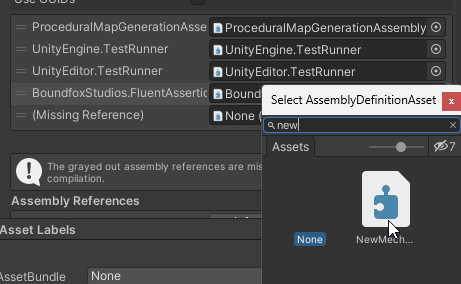

# Mechanic Creation
## Set Up<br>
### Assembly Creation<br>
Create a folder within the  components name with in the /SRC folder<br>
<br>
Create a new Assembly for the mechanic.<br>

Name the assembly to match the mechanic intended for creation with the suffix of "Assembly".<br>
<br>
Add a ReadMe.md for the mechanic.<br>
This ReadMe.md should house all nessacary information about the mechanic in quiestion:<br>
- How to set it up.<br>
- File Structure.<br>
- How it was created.<br>
- Third Party Components used.<br>
- Where the example scene is located.<br>
- Anything else needed for a new dev to use the mechanic.<br>

<strong><span style="color:Yellow">Note:</span><span style="color:grey"> *Remember to link it in the main [README](../../README.md).* </span>.</strong>

### Assembly Set Up<br>
In the Test Assembly, add a reference to youre new assembly.<br>
<br>
<br>
<br>
You may need to add in a shared Assembly to your new Assembly if a shared Assembly has been created. (One has not been created as of writing).<br>

### File Structure<br>
```json
NewMechanic/
├── Enums/  // Contains any enumeration types.
├── Exceptions/ // Contains custom exception types.
├── Structs/ // Contains any struct types.
├── Interfaces/ // Contains any interface types.
├── Utilities/ // Contains any utility classes or functions. 
├── Resources/ // Contains items that needs to be accessed during run time. 
|   └── Scriptable Objects/ // Contains created scriptable objects.
├── Generators/ // Contains code for generators.
|   └── Noise/ // Contains any Noise generators.
├── Mono/ // Contains any MonoBehaviours.
|   ├── Behaviors/ // Contains any custom MonoBehaviour scripts. 
|   ├── Managers/ // Contains any manager classes. 
|   └── Scriptable Objects/ // Contains core scriptable object scripts.
├── Aids/ // Contains any art assets.
|   ├── Meshes/ // Contains 3D models or meshes. 
|   ├── Scenes/ // Contains scene files.
|       ├── SetUpScenes/ // Contains scenes used to set up the Mechanic.
|       ├── ExampleScenes/ // Contains example scenes used to showcase features.
|       └── MiscScenes/ // Contains any other miscellaneous scenes.
|   ├── Materials/ // Contains materials. 
|   ├── Textures/ // Contains textures.
|   └── Prefabs/  // Contains prefabs.
|       ├── CorePrefabs/ // Contains essential prefabs.
|       ├── WorkingPrefabs/ // Contains prefabs that are currently in development.
|       └── MiscPrefabs/ // Contains any other miscellaneous prefabs used.
└── Helpers/  // Contains any helper classes or functions.
```
<span style="color:red">** Finish up **</span>